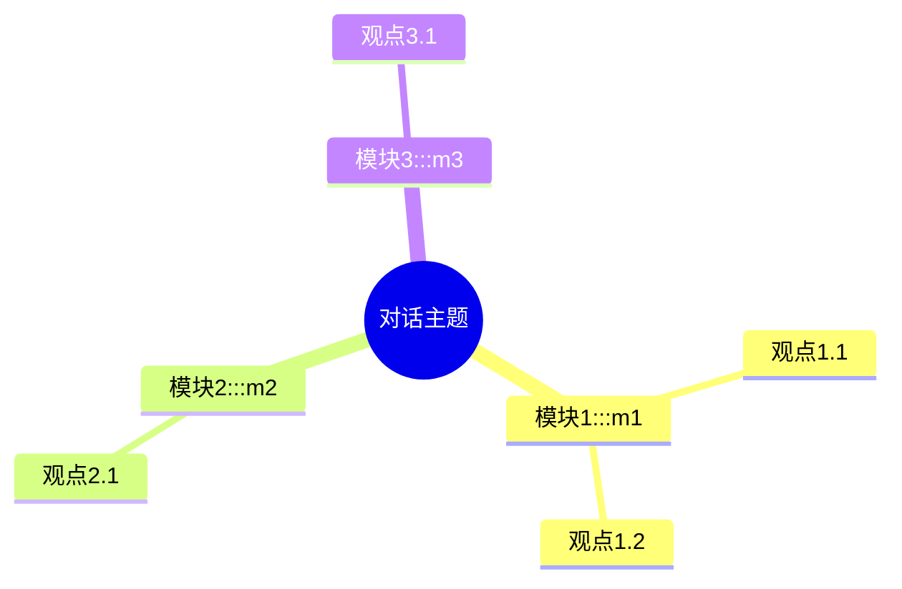

# 学习内容分析助手

分析各类学习内容，生成清晰的中文思维导图、核心观点总结与关键结论。

---

## 🚨 最重要的规则：内容准确性

**绝对禁止凭空编造内容！**

- **必须先搜索验证**：拿到链接后，必须先用 WebFetch 或 WebSearch 搜索播客/视频的简介、章节、嘉宾信息
- **找不到内容时**：必须告诉用户"找不到内容"，询问是否需要转录，**不能编造**
- **信息准确性 > 用户体验**：宁可告诉用户"信息不足"，也不能编造看起来合理但错误的内容
- **转录优先**：对于没有现成文稿的优质内容，应该建议用户进行转录，而不是编造内容

### 处理流程：
1. **拿到链接 → 第一步：搜索验证**（用 WebFetch 抓取页面信息）
2. **如果找到详细章节/简介** → 基于真实信息生成
3. **如果信息不足** → 告诉用户"信息有限，是否需要转录？"
4. **绝对不能**：不搜索就编造看起来合理但完全错误的内容

---

## 🚀 快速开始

### 完整工作流（推荐）

```
用户给链接 → 下载音频 + 自动编号 + 标题命名 + 网络版文稿 → 用户用豆包转录
                                                                 ↓
生成 HTML ← 处理转录稿（格式化 + 说话者 + 词语校正）
```

**文件夹结构：每个转录一个独立文件夹，自动编号递增（01_, 02_, 03_...）**

```
output/
├── 01_秦深涛_神经接口的下一个十年/
│   ├── audio.mp3
│   ├── transcript_web.md      (网络版文稿)
│   ├── 豆包转录提示词.txt     (可直接复制给豆包)
│   ├── doubao_transcript.txt   (用户放豆包转录稿)
│   ├── transcript_processed.md (处理后转录稿)
│   ├── analysis.html         (HTML 阅读页)
│   ├── key_points.md         (核心观点)
│   └── mindmap.md            (思维导图)
├── 02_张一鸣_字节跳动创业故事/
│   └── ...
```

**使用方式：把视频/播客链接或音频文件直接发给我，我会引导完成。**

---

#### 手动命令版

**步骤 1：下载并准备（自动编号 + 独立文件夹 + 网络版文稿 + 豆包提示词）**
```bash
python3 .trae/skills/learning-content-analyzer/learning_pipeline.py "视频URL或音频文件"
```
自动完成：
- 下载音频（B站/YouTube/本地文件）
- **自动分配序号**（扫描现有文件夹，按序递增：01_, 02_, 03_...）
- **用原链接标题简化命名**（去掉特殊字符，截取前40字）
- **创建独立文件夹**：`{序号}_{标题}`
- **输出一版基于网络搜索的文稿**（搜索网上现成文稿，找不到则用简介）
- 识别说话者姓名
- **生成豆包提示词文件**（`豆包转录提示词.txt`，含说话者、专有名词、格式要求，可直接复制）

**步骤 2：处理豆包转录稿 + 生成 HTML**
```bash
python3 .trae/skills/learning-content-analyzer/learning_pipeline.py \
  --process 01_xxx/doubao_transcript.txt \
  --speakers "张津剑,秦深涛"
```
自动完成：
- 解析豆包格式（`Speaker X HH:MM:SS.mmm`）
- 合并同一说话者的连续发言
- 词语校正（1200+ 条术语字典）
- 口语化表达清理
- 生成 HTML 阅读页 + 思维导图 + 核心观点
- **所有输出都在同一个项目文件夹里**

> 对话内容提炼的完整设计规范（两层 HTML 输出体系、Issue Tree 拆解、五色分区系统、HTML 页面结构、质量检查清单）见下方「📊 对话内容提炼」章节。

---

### 豆包转录处理工具

[process_doubao_transcript.py](file:///process_doubao_transcript.py) — 只处理豆包转录稿，不生成 HTML

```bash
# 基础用法
python3 .trae/skills/learning-content-analyzer/process_doubao_transcript.py 豆包转录稿.txt

# 手动指定说话者
python3 .trae/skills/learning-content-analyzer/process_doubao_transcript.py 转录稿.txt \
  --speakers "张津剑,秦深涛"

# 自定义术语字典（JSON 格式：{错误: 正确}）
python3 .trae/skills/learning-content-analyzer/process_doubao_transcript.py 转录稿.txt \
  --term-file custom_terms.json

# 常用参数
--output FILE       指定输出文件
--no-merge          不合并同一说话者的连续发言
--no-correct        不进行词语校正
--no-clean          不清理口语化表达
--max-gap SECONDS   合并最大间隔秒数（默认 60）
```

---

### 方式二：本地 Whisper 转录（备选，无需网络）

适合离线场景或豆包无法处理的音频。

#### 安装基础依赖（只需一次）
```bash
brew install ffmpeg
pip3 install yt-dlp openai-whisper requests beautifulsoup4
```

#### 安装音色识别依赖（推荐，用于精准区分说话者）

转录默认会尝试音色识别（pyannote.audio）来区分不同说话者。未安装时会自动回退到基于沉默间隔的简单分组（不精准）。

> **Python 版本要求**：pyannote.audio 3.x 需要 **Python 3.10+**。macOS 自带的 `/usr/bin/python3` 是 3.9，需先用 Homebrew 安装高版本：
> ```bash
> brew install python@3.11
> # 之后用 python3.11 代替 python3 运行转录脚本
> ```

**Agent 为用户安装步骤：**

```bash
# 步骤0：确认 Python 版本 >= 3.10（macOS 自带 3.9 不够）
python3 --version
# 若低于 3.10，先安装：
brew install python@3.11

# 步骤1：安装 pyannote.audio 和 torch（约 2GB，含 PyTorch）
pip3 install pyannote.audio torch
# 若用 python3.11：python3.11 -m pip install pyannote.audio torch
```

```bash
# 步骤2：配置 HuggingFace token（pyannote 模型需要授权下载）
# 2.1 提示用户访问以下链接（用浏览器打开，国内可能需要代理）：
#      - 注册/登录：https://huggingface.co
#      - 申请 pipeline 权限：https://huggingface.co/pyannote/speaker-diarization-3.1
#        （点击 "Agree and access repository"）
#      - 申请子模型权限：https://huggingface.co/pyannote/segmentation-3.0
#        （点击 "Agree and access repository"，这步容易漏！）
#      - 生成 token：https://huggingface.co/settings/tokens
#        （New token → 权限选 Read → 复制 token 字符串）

# 2.2 将 token 写入配置文件（用户需把 <TOKEN> 替换为自己的 token）：
echo 'hf_xxxxxxxxxxxxxxxxxxxx' > ~/.huggingface_token
```

```bash
# 步骤3：验证安装
python3 -c "from pyannote.audio import Pipeline; print('✅ pyannote.audio 安装成功')"
# 若用 python3.11：python3.11 -c "from pyannote.audio import Pipeline; print('ok')"
```

**Agent 注意事项：**
- 安装 torch 较大（macOS 约 500MB-2GB），提前告知用户下载量
- token 是敏感信息，写入 `~/.huggingface_token` 后不要在对话中回显完整 token
- 如果用户没有 HuggingFace 账号或不想申请，跳过此步，转录仍可用简单分组
- 模型首次运行会自动下载（约 1GB），之后缓存在 `~/.cache/huggingface/`
- **Python 版本**：pyannote.audio 3.x 要求 Python 3.10+，低于此版本安装会失败

#### 使用方式

直接把视频/播客链接发给我，我会：
1. 用 yt-dlp 获取标题和简介（shownotes），**判断受访者姓氏**用于文件命名
2. **自动识别说话者**：从 shownotes 中提取主持人/嘉宾姓名（如"嘉宾：张三、李四"），自动映射到 SPEAKER_00/01
3. 先搜索网上是否有现成文稿
4. 判断网络内容准确性
5. 如果搜索结果质量不高，会提示你是否需要转录
6. 如果你同意，会进行音频转录（自动传入 `--name 姓氏` 和说话者映射）
7. **音色识别区分说话者**（已安装 pyannote 则用音色，否则回退简单分组）
8. **自动校正**（已在脚本内完成，秒级，无需 AI 介入）
9. 综合多版本信息，生成完整分析

**文件命名规则**：`transcript_{序号}_{姓}.txt`
- AI 会从标题/简介中识别受访者，例如标题 `翁家翌：OpenAI，GPT...` → `--name weng`
- 如果无法判断，AI 会询问用户

**说话者自动识别**：
- 从 shownotes（节目简介）自动提取主持人和嘉宾姓名
- 支持格式：「嘉宾：张三、李四」「主持：王五」「SPEAKER 01: 张三」「张三（嘉宾）」等
- 提取到姓名后自动映射到 SPEAKER_00/01，转录稿直接显示真实姓名
- 两人以上对话时自动启用 `--speaker` 说话者识别

### 🔧 自动校正（已内置，无需 AI 介入）

转录脚本**默认自动执行 A+B+C 校正**（秒级完成，无需大模型）：

**方案 A：字典校正（<1秒）**
- 内置 Whisper 中文常见错字字典（约 300+ 条）
- 覆盖：台湾用语→大陆用语（人工智慧→人工智能）、繁简异体、常见音译错字、投资/商业术语
- 脚本运行时自动替换，输出已校正的 txt/md

**方案 B：专有名词校正（<1秒）**
- 从视频标题自动提取专有名词（英文人名、公司名、缩写）
- 针对性校对转录稿中的对应错误（如标题含 OpenAI → 修正"开放AI""奥本AI"等）
- 内置 50+ 常见科技公司/人物/术语映射表

**方案 C：上下文一致性校正（<1秒）**
- 同一专有名词前后写法不一致时，统一为标准写法
- 如同时出现"马斯克"和"馬斯克"，统一为"马斯克"

**校正原则：**
- ✅ 只改错别字和专有名词，**不改变原意**
- ✅ 保持时间戳、说话者标签、格式不变
- ❌ 不删除/添加内容、不重组段落

**关闭自动校正：**
```bash
python3.11 ... --no-correct  # 跳过自动校正（保留原始转录）
```

### ⚡ 速度与准确率优化

**提速优化（默认已启用）：**
- **VAD 静音过滤**：自动跳过静音段，提速约 1.5-2 倍
- **Apple Silicon MPS GPU 加速**：自动检测并启用，提速 2-3 倍
- **可关闭 VAD**：`--no-vad`（需要精准时间戳时用）

**准确率优化：**

| 优化项 | 效果 | 开关 |
|--------|------|------|
| initial_prompt 上下文提示词 | 专有名词识别提升显著 | 默认自动生成（从标题/shownotes） |
| 音频预处理（降噪+标准化） | 噪音大的音频提升明显 | `--preprocess` 手动开启 |
| 模型升级（small/medium） | 准确率大幅提升 | `--small` 或 `--medium` |
| 指定语言 `--zh` | 避免语言检测错误，同时更准 | `--zh` / `--en` / `--ja` |
| A+B+C 自动校正 | 修正 80% 常见错误 | 默认开启 |

**initial_prompt（零成本提升）：**
- 自动从标题和 shownotes 提取关键词、人名、公司名
- 生成上下文提示词传给 Whisper，让模型"知道"要转录的内容
- 对专有名词识别的提升效果非常明显，且完全不影响速度
- 手动指定：`--initial-prompt "这是一档关于 AI 的播客，嘉宾张潇雨、翁家翌"`

**音频预处理（`--preprocess`）：**
- 降噪（afftdn 频域降噪）
- 音量标准化（loudnorm 到 -16 LUFS）
- 重采样为 16kHz 单声道（Whisper 标准输入格式）
- 依赖：系统已安装的 ffmpeg
- 适合：背景噪音大、音量偏小或忽大忽小的音频

### 🤖 AI 深度校正（可选，非必做）

自动校正已覆盖 80% 常见错误。仅当以下情况才需要 AI 介入：
- 内容涉及**罕见专有名词**（字典未覆盖的人名/术语）
- 用户**明确要求**精准校正
- 自动校正后仍有明显错误

**AI 校正流程（仅必要时）：**
1. Read 读取 txt
2. 识别自动校正未覆盖的错误
3. WebSearch 验证不确定的专有名词
4. Edit 逐处修正
5. 告知用户修正点

**示例：**
```
自动校正后: 00:05:23 - 翁家翌说 OpenAI 的 GPT-4...  ← 已校正
AI 深度校正: 00:05:23 - 翁家翌说 OpenAI 的 GPT-4...  ← 无需再改
```

#### 方式二：使用脚本转录（两种版本）

**基础版本（quick_transcribe.py）** - 简单易用
```bash
cd /path/to/your/project
python3.11 .trae/skills/learning-content-analyzer/quick_transcribe.py "视频或播客链接"

# 带受访者姓氏，用于文件命名（推荐）
python3.11 .trae/skills/learning-content-analyzer/quick_transcribe.py "视频或播客链接" --name xie
# 输出文件: transcript_1_xie.txt（序号自动递增，不会覆盖之前的转录）
```

**高级版本（local_whisper_transcriber_v2.py）** - 强大功能
```bash
cd /path/to/your/project
# 基本使用
python3.11 .trae/skills/learning-content-analyzer/local_whisper_transcriber_v2.py "视频或播客链接"

# 带自定义说话者名称和多种输出格式
python3.11 .trae/skills/learning-content-analyzer/local_whisper_transcriber_v2.py \
  "视频或播客链接" \
  --ja --speaker \
  --speaker-names "妹岛和世,西泽立卫,主持人" \
  --formats "txt,srt,vtt,md" \
  --output-dir ./outputs
```

---

## 🧠 输出格式要求

### 必须用Plain Text代码块展示：
```
📚 内容框架

├── 1. 章节标题 [时间戳]
│   ├── 要点1
│   ├── 要点2
│   └── 要点3

└── 2. 下一章节 [时间戳]
    └── ...

💡 核心观点总结（引用原文）
1. 观点标题
   原文引用："原文内容"

2. ...

📊 关键结论
1. 结论1
2. 结论2
...
```

### 核心规则：
- **树形格式**：用 `├──`、`└──`、`│` 展示层级
- **核心观点**：10个以内，每个观点必须引用原文
- **关键结论**：5个最重要的结论
- **时间戳**：如有时间轴，在一级标题后加上 `[时间]`
- **中文优先**：所有内容用中文展示

---

## 💬 问答交互

基于生成的内容，你可以：
- 询问不理解的概念
- 深入探讨感兴趣的主题
- 请求举例说明

---

## 🛠️ 常见问题

### Q: 转录文件会被覆盖吗？如何命名？
**A:** 不会覆盖！转录文件使用 `transcript_{序号}_{姓}.txt` 格式自动命名：
- 不带 `--name`：`transcript_1.txt`、`transcript_2.txt`...（序号自动递增）
- 带 `--name xie`：`transcript_1_xie.txt`、`transcript_2_xie.txt`...
- 带 `--name 谢`：`transcript_1_谢.txt`、`transcript_2_谢.txt`...
- 系统会扫描目录中已有文件，自动递增序号，不会覆盖

```bash
# 推荐：带受访者姓氏
python3.11 .trae/skills/learning-content-analyzer/quick_transcribe.py "视频链接" --name xie
```

### Q: 提示 `zsh: command not found: python` 怎么办？
**A:** macOS 上使用 `python3.11`（音色识别需要 3.10+，见上方安装说明）：
```bash
python3.11 .trae/skills/learning-content-analyzer/quick_transcribe.py "视频链接"
```

### Q: 提示 `No such file or directory` 怎么办？
**A:** 确认你在正确的项目目录（包含 `.trae` 文件夹的目录）：
```bash
cd /path/to/your/project
python3.11 .trae/skills/learning-content-analyzer/quick_transcribe.py "视频链接"
```

### Q: `pip` 命令找不到怎么办？
**A:** 使用 `pip3`：
```bash
pip3 install yt-dlp openai-whisper
```

### Q: B站视频下载失败（HTTP 412或其他错误）怎么办？
**A:** B站有反爬虫机制，需要以下解决方案之一：

**方案1：使用浏览器cookies（推荐）**
1. 安装浏览器插件如"EditThisCookie"或"Cookie Inspector"
2. 登录B站
3. 导出cookies到文件：`~/.bilibili_cookies.txt`
4. 再次运行转录脚本

**方案2：手动下载后转录本地文件**
1. 登录B站网页版
2. 下载视频到本地（如 BV1tYGdzHEp2.mp4）
3. 使用本地文件路径转录：
```bash
python3.11 .trae/skills/learning-content-analyzer/quick_transcribe.py "/path/to/BV1tYGdzHEp2.mp4"
```

**方案3：使用其他视频源**
- 如果视频也在YouTube或其他平台发布，优先使用其他平台链接
- 其他平台通常没有这么严格的反爬虫限制

### Q: 如何识别和区分不同的说话者？
**A:** 使用说话者识别功能（Speaker Diarization）：

**基础用法：自动分组（基于沉默间隔）**
```bash
python3.11 .trae/skills/learning-content-analyzer/quick_transcribe.py "视频链接" --speaker
```

**高级用法：使用专业说话者识别（可选）**
如果需要更准确的说话者识别，可以安装 `pyannote.audio`：
1. 在 https://huggingface.co/pyannote/speaker-diarization 申请访问权限
2. 安装依赖：
```bash
pip3 install pyannote.audio torch
```
3. 运行转录时会自动使用

**转录输出格式示例（对话段落式）：**
```
[00:00:00 - 00:01:23] [张潇雨]
今天我们要讨论的是人工智能的最新进展。首先要理解的是，GPT 这类大模型的核心原理是什么。

[00:01:23 - 00:02:45] [翁家翌]
我有不同的看法。我认为更重要的是理解模型的能力边界，而不是原理本身。
```

**格式说明：**
- 同一说话者的连续发言合并为一个段落
- 每段开头标注「时间段」和「说话者姓名」
- 说话者姓名从 shownotes 自动提取，无需手动指定
- 支持多人对话（2人、3人及以上）

---

## 📊 对话内容提炼

从播客/访谈/讲座等对话转录文本中提取核心观点，生成思维导图、标注来源、输出精美 HTML 阅读页。

### 何时使用

当用户出现以下需求时，进入对话提炼模式：

1. "提炼一下这段播客/访谈的核心内容"
2. "从这个转录文件生成一个 HTML 阅读版"
3. "帮我整理这个对话的思维导图"
4. "这个播客里 [某话题] 相关的内容有哪些？"
5. "每段观点都标注一下来源和时间戳"
6. 有 `.txt`/`.md`/`.srt` 转录文件，要求分析、提炼、总结、生成报告

### 两层 HTML 输出体系

| 层级 | 工具 | 特点 | 适用场景 |
|------|------|------|---------|
| **L1 快速预览版** | `dialogue_extractor.py` | 基于规则的启发式提炼，秒级生成，自动分类原文段落 | 快速浏览、初步了解结构 |
| **L2 AI 深度分析版** | `ai_html_generator.py` + AI | AI 深度提炼，技术概念解析，思维导图经过总结，有原文依据标注 | 深度研究、技术学习、高质量输出 |

**L2 AI 深度分析版包含：**
- ✅ **AI 提炼思维导图**（不是原文截取，是经过理解总结的节点）
- ✅ **核心洞察**（最有价值的 3-5 个深度观点）
- ✅ **技术概念深度解析**（如 MUAP、Neural Mismatch、Golden Label 等，含解释、重要性、关联）
- ✅ **主题模块深度分析**（每个观点有 AI 解读 + 原文依据标注）
- ✅ **金句精选**（AI 挑选 + 点评）

> 💡 **L1 是规则启发式**，适合快速预览；**L2 由 AI 深度提炼**，适合高质量输出。两者遵循同一套设计规范（见下文）。

### 完整工作流程

#### 第一步：输入分析 & 内容盘点

输入可能是：本地转录文件路径（.txt/.md/.srt/.vtt）、多个文件、网页链接、直接粘贴的文本。

先做内容盘点：
```
□ 有多少个文件？总字数/时长大概多少？
□ 对话主题是什么？有哪些关键人物？
□ 用户最关心的话题/方向是什么？
□ 转录质量如何？有没有明显的识别错误？
```

#### 第二步：结构化提取（核心环节）

**2.1 主题识别（Issue Tree 拆解）**

先用 Issue Tree 把对话内容拆解为 **3-7 个核心主题模块**：

```
对话总主题
├── 模块 1：[主题 A]
│   ├── 核心观点 1.1
│   ├── 核心观点 1.2
│   └── ...
├── 模块 2：[主题 B]
│   ├── 核心观点 2.1
│   └── ...
└── ...
```

**模块划分原则：**
- 按**话题领域**划分（如：产品方法论、AI 技术、组织管理）
- 每个模块有明确边界，不重叠
- 模块数量控制在 **3-7 个**（太少不够细，太多记不住）
- 按重要性/用户关注度排序

**2.2 观点提取（每个观点都要有来源）**

对每个核心观点，提取以下信息：

| 字段 | 说明 | 必填 |
|------|------|------|
| **观点内容** | 用一句话概括核心观点 | ✅ |
| **原文引用** | 说话人的原话（1-3 句，最精华的部分） | ✅ |
| **说话人** | 是谁说的 | ✅ |
| **时间戳** | 在转录文件中的大概位置（如 01:23:45） | ✅ |
| **来源文件** | 哪一期/哪个文件 | 多文件时必填 |
| **上下文说明** | 观点是在什么语境下提出的 | 可选 |

**提取原则：**
- ✅ **宁多勿漏**：重要观点全部提取，不要主观筛选掉"你觉得不重要"的
- ✅ **忠实原文**：用说话人的原话，不要 paraphrase 成自己的话
- ✅ **标注来源**：每个观点都必须能追溯到原文位置
- ✅ **保持语境**：不要断章取义，必要时附上上下文说明

**2.3 金句采集**

单独收集最精彩、最有传播力的金句：
- 简短有力（1-2 句话）
- 有记忆点、适合引用
- 能代表说话人的核心思想

#### 第三步：思维导图生成

用 **Mermaid mindmap** 语法生成结构化思维导图，嵌入到 HTML 中。



**配色对应模块主题色**（五色分区系统，见下文）。

#### 第四步：HTML 页面生成

使用 **Tailwind 现代风格**，遵循下述设计系统。

### HTML 设计系统

**字体系统：**
- 标题：Cormorant Garamond (serif, 700)
- 正文：Noto Sans SC (sans, 400)
- 数字/统计：Cormorant Garamond (tabular-nums)

**五色分区系统**（同时用于思维导图配色和模块卡片）：

| 模块类型 | 主色 | 背景色 | 适用内容 |
|---------|------|--------|---------|
| 基础概念 | indigo-400/600 | bg-indigo-50 | 背景介绍、概念定义、底层原理 |
| 方法框架 | teal-400/600 | bg-teal-50 | 方法论、步骤流程、策略原则 |
| 技术实践 | amber-400/600 | bg-amber-50 | 技术细节、实操方法、落地经验 |
| 应用案例 | sky-400/600 | bg-sky-50 | 真实案例、故事经历、具体例子 |
| 核心洞察 | rose-400/600 | bg-rose-50 | 本质观点、核心感悟、关键总结 |

**标签语义约定：**

| 标签类型 | 颜色 | 示例 |
|---------|------|------|
| 核心观点 | rose-50 / text-rose-600 | 「核心」「关键」 |
| 方法/框架 | indigo-50 / text-indigo-600 | 「框架」「方法论」 |
| 实践/案例 | amber-50 / text-amber-600 | 「案例」「实践」 |
| 金句/引用 | teal-50 / text-teal-600 | 「金句」「引用」 |
| 来源标注 | zinc-100 / text-zinc-500 | 「Ep.2」「01:23:45」 |

### HTML 页面结构

```
1. Hero 区域
   ├── 标题 + 副标题
   ├── 数据概览（多少期/多少小时/多少字/多少模块）
   ├── 模块快速导航卡片
   └── 向下滚动提示

2. 思维导图区域（可折叠展开）
   └── Mermaid 思维导图

3. 模块 N（每个模块一个 section）
   ├── 模块标题 + 大背景数字
   ├── 观点卡片（每个观点一张）
   │   ├── 观点标题
   │   ├── 观点解释/展开
   │   ├── 原文引用（blockquote 样式）
   │   ├── 来源标签（说话人 · 来源 · 时间戳）
   │   └── 相关话题标签
   └── 模块小结

4. 金句墙
   └── 精选 5-10 条金句，卡片式排版

5. 数据来源 / 附录
   ├── 转录文件列表
   ├── 提取说明
   └── 使用说明
```

**交互功能：** 顶部进度条、悬浮侧边导航、卡片渐入动画、回到顶部、响应式布局、可折叠区块。

### 质量检查清单

生成 HTML 前，对照检查：

```
□ 所有核心观点都标注了来源（说话人 + 文件 + 时间戳）
□ 思维导图覆盖了所有主要模块和观点
□ 金句数量适中（5-15 条），每条都是真正精彩的
□ 没有明显的转录错误保留在观点中
□ 页面在手机端也能正常阅读
□ 颜色系统符合五色分区约定
□ 观点提取完整——用户关心的话题没有遗漏
□ 原文引用忠实于转录文本，没有断章取义
```

### 快速使用

**方式1：L1 快速预览版（规则启发式，秒级）**

```bash
# 对已有的转录文件做提炼
python3.11 .trae/skills/learning-content-analyzer/dialogue_extractor.py \
  transcript_1_lixiang.txt \
  --title "对谈李想" \
  --output-dir ./output
```

**方式2：L2 AI 深度分析版（AI 提炼 + 渲染）**

用户提出「深度分析」「生成高质量 HTML」等需求时：
1. AI（豆包）通读转录稿，按上述工作流程做深度结构化提取
2. 生成结构化 JSON 数据（思维导图、核心洞察、技术概念、模块、金句）
3. 用 `ai_html_generator.py` 渲染为 HTML：
```bash
python3.11 .trae/skills/learning-content-analyzer/ai_html_generator.py \
  深度分析.json --output 深度分析.html
```

### 输入格式支持

```
格式1（推荐）：
[00:00:00 - 00:01:23] [罗永浩]
大家好，我是罗永浩...

格式2：
[00:00:00 - 00:01:23] 罗永浩: 大家好，我是罗永浩...

格式3：
罗永浩: 大家好，我是罗永浩...
```

### 输出文件

生成 3 个文件，保存在转录文件同目录：

| 文件 | 说明 |
|------|------|
| `xxx_analysis.html` | ⭐ 主 HTML 页面（核心产出，浏览器打开即可阅读） |
| `xxx_key_points.md` | 核心观点 Markdown 版（方便复制/二次编辑） |
| `xxx_mindmap.md` | 思维导图 Markdown 版（Mermaid 语法） |

### L1 观点提取原理（启发式）

`dialogue_extractor.py` 基于规则的启发式提炼，秒级生成：
- **长度权重**：嘉宾的长回答更可能是核心观点
- **核心词检测**：含"本质/核心/关键/我觉得/我认为"等的段落加分
- **金句模式**：16 种金句表达模式匹配（"X 的本质是"、"最关键的是"等）
- **角色识别**：自动识别主持人/嘉宾，嘉宾的话权重更高
- **位置推断**：中间 20%-80% 是主要内容区
- **模块分类**：关键词 + 位置综合判断归类

> 适合快速预览。如需深度提炼（技术概念解析、AI 总结思维导图、核心洞察），请用 L2 AI 深度分析版。

---

## 📂 相关工具

- **learning_pipeline.py** - ⭐ 完整 Pipeline（下载→命名→指引豆包转录→处理→生成HTML）
- **process_doubao_transcript.py** - 豆包转录稿处理工具（格式化 + 说话者 + 词语校正）
- **dialogue_extractor.py** - 📊 对话内容提炼工具（观点提取 + 思维导图 + HTML，L1 快速预览版）
- **ai_html_generator.py** - 🎨 AI 深度分析 HTML 生成器（L2 高质量版，AI 提炼 + 技术解析）
- **content_searcher.py** - 智能文稿搜索工具（先搜索网络文稿）
- **transcript_corrector.py** - 转录稿自动校正工具（1200+ 术语字典，含 `--reformat` 重格式化）
- **quick_transcribe.py** - 快速本地转录工具（备选方案）
- **local_whisper_transcriber_v2.py** - 本地 Whisper 转录工具（离线备选）

### transcript_corrector.py 重格式化功能（`--reformat`）

**用途**：修复转录稿中说话者标注错乱、段落合并过度、`SPEAKER_XX` 未映射等问题。

**自动检测与修复**：
1. **Markdown 格式解析**：支持 `**[时间 - 时间] [说话者]**` 加粗格式
2. **不可靠标签检测**：出现 `SPEAKER_XX` 或段落超过 5 分钟 → 判定原标签不可靠
3. **超长段落切分**：`split_long_segments` 按问号/句号切分 25 分钟独白为多段
4. **重新分配说话者**：清除不可靠的原标签，基于问答模式（问号结尾+长度对比）重新交替分配
5. **合并上限**：单段落最多 5 分钟/800 字符，防止再次合并成超长段落

**命令示例**：
```bash
# 修复说话者标注错乱 + 段落切分
python3 .trae/skills/learning-content-analyzer/transcript_corrector.py \
  transcript_1_qin.md --reformat --speakers "张津剑,秦深涛" --title "张津剑对谈秦深涛"
```

**修复效果**（transcript_1_qin 实测）：
- 原 17 段（含 5 个 SPEAKER_03，最长 25 分钟）→ 修复后 65 段（最长 4.35 分钟）
- SPEAKER_03 全消除，张津剑/秦深涛问答交替正常恢复

### local_whisper_transcriber_v2.py 高级功能

**V2.0 新功能：**
1. **对话段落式格式** - 同一说话者连续发言合并为一个段落，更易读
2. **说话者自动识别** - 从 shownotes/简介自动提取主持人/嘉宾姓名，自动映射到 SPEAKER_00/01
3. **initial_prompt 上下文提示词** - 从标题/shownotes 自动生成，大幅提高专有名词识别率
4. **音频预处理** - 降噪 + 音量标准化 + 重采样 16kHz，噪音大的音频准确率显著提升（`--preprocess`）
5. **VAD 静音过滤** - 默认开启，跳过静音段，提速 1.5-2 倍
6. **A+B+C 自动校正** - 字典校正 + 专有名词校正 + 上下文一致性校正，秒级完成
7. **繁简自动转换** - Whisper 中文转录默认输出繁体，自动转成简体
8. **多种输出格式** - 同时生成 TXT、SRT、VTT、JSON、MD 多种格式
9. **自定义说话者名称** - 可指定 SPEAKER_01, SPEAKER_02 对应的真实姓名
10. **统一命名规则** - 所有格式使用 `transcript_{序号}_{姓氏}.{ext}` 命名，序号跨格式递增不覆盖
11. **受访者姓氏自动提取** - 从标题自动识别姓氏用于命名，也可用 `--name` 手动指定
12. **输出目录自定义** - 可指定输出目录
13. **更好的命令行解析** - 使用 argparse 提供更友好的帮助

**完整参数说明：**
```
位置参数：
  input                   视频链接或本地音频文件路径

可选参数：
  -h, --help              显示帮助信息
  --zh, --cn, --chinese   指定为中文
  --ja, --jp, --japanese  指定为日语
  --en, --english         指定为英语
  --tiny                  最快，但准确率最低（约 32MB）
  --base                  推荐日常使用（约 150MB，默认）
  --small                 更准确，但更慢（约 500MB）
  --medium                非常准确，但很慢（约 1.5GB）
  --speaker, --diarize    启用说话者识别
  --speaker-names SPEAKER_NAMES
                          自定义说话者名称，格式: "SPEAKER_01=张三,SPEAKER_02=李四" 或直接 "张三,李四"
  --formats FORMATS       输出格式，多个用逗号分隔: txt,srt,vtt,json,md
  --output-dir OUTPUT_DIR
                          输出目录，默认为当前目录
  --name NAME             受访者/作者姓氏，用于文件命名（如 --name xie → transcript_1_xie.txt）
                          不指定时自动从视频标题提取
  --no-simplified         关闭繁体→简体转换（默认开启）
  --no-correct            关闭自动校正（默认开启：字典+专有名词+一致性校正）
  --preprocess            启用音频预处理（降噪+音量标准化+重采样，提高准确率）
  --no-vad                关闭 VAD 静音过滤（默认开启，提速约 1.5-2 倍）
  --initial-prompt PROMPT 手动指定 Whisper 初始提示词（不指定时自动从标题/shownotes生成）
  --audio-dir AUDIO_DIR   音频下载目录
```

**文件命名规则**（所有格式统一）：
- 不带 `--name`：`transcript_1.txt`、`transcript_1.md`、`transcript_1.srt`...（同一转录的多个格式共用序号）
- 带 `--name xie`：`transcript_1_xie.txt`、`transcript_1_xie.md`、`transcript_1_xie.srt`...
- 自动提取：标题 `翁家翌：OpenAI...` → `transcript_1_翁.txt`
- 序号跨所有格式扫描递增，绝不覆盖已有文件

**说话者标签**（智能开关）：
- **默认用简单分组**（基于沉默间隔，快）：单人独白/快速预览场景
- **`--speaker` 启用音色识别**（pyannote.audio，精准但慢）：访谈/对话场景
- **自动识别说话者姓名**：从 shownotes/简介提取主持人/嘉宾，自动映射真实姓名
- 所有格式（txt/md/srt/vtt/json）都会标注说话者
- 输出示例（对话段落式）：
  ```
  [00:05:23 - 00:08:45] [张潇雨]
  今天我们聊聊人工智能的最新进展...
  ```
- `--speaker-names "张三,李四"`：手动指定说话者姓名（优先于自动识别）

**Agent 判断逻辑**（自动决定是否加 `--speaker`）：
- 标题/简介含「对话」「访谈」「对谈」「采访」「&」「×」「vs」→ 加 `--speaker`
- 单人演讲、独白、讲座、教程 → 不加（用默认简单分组）
- 不确定时默认不加（快速优先，用户可手动重跑加 `--speaker`）

**速度优化**：
- 自动启用 Apple Silicon MPS GPU 加速（需安装 torch）
- 转录跳过长静音段（VAD）
- 默认 base 模型；中文内容用 `--small` 准确率更高但仍较快

**繁简转换**（默认开启）：
- Whisper 中文转录默认输出**繁体**，本工具自动转成**简体中文**
- 优先用 opencc（精准）：`pip3 install opencc-python-reimplemented`
- 未安装 opencc 时回退到内置高频字映射（覆盖常见繁简差异字）
- 加 `--no-simplified` 可关闭转换（保留原始繁体）

**使用示例：**
```bash
# 基本使用，只生成 TXT
python3.11 .trae/skills/learning-content-analyzer/local_whisper_transcriber_v2.py "视频链接"

# 带说话者识别和自定义名称
python3.11 .trae/skills/learning-content-analyzer/local_whisper_transcriber_v2.py \
  "视频链接" --speaker --speaker-names "妹岛和世,西泽立卫,主持人"

# 多种输出格式
python3.11 .trae/skills/learning-content-analyzer/local_whisper_transcriber_v2.py \
  "视频链接" --formats "txt,srt,vtt,md"

# 完整示例
python3.11 .trae/skills/learning-content-analyzer/local_whisper_transcriber_v2.py \
  "视频链接" \
  --ja --speaker \
  --speaker-names "妹岛和世,西泽立卫,主持人" \
  --formats "txt,srt,vtt,json,md" \
  --output-dir ./outputs
```
